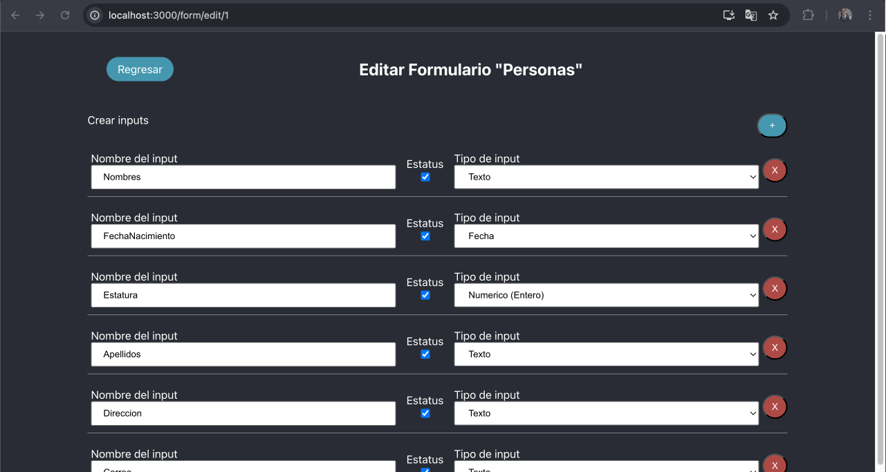

# Formulario dinamico
Sistema diseñado para la creacion de formularios dinamicos en el cual fue desarrollado para SQL usando sql server en un contenedor docker, y C# .net para su utilización con un frontend desarrollado en React

## 1. Requisitos.
### 1.1 Base de datos
Para la ejecución del sistema, es importante la generación de la base de datos, se uso docker como contenedor para su creacion, los comandos estan incluidos en el directorio **/db** en la raíz del proyecto, mas especifico el en el subdirectorio: **/db/1. docker**, en dicho directorio, se encuentra tanto los pasos para la creacion del contenedor con las credenciales a usarse.

En el subdirectorio llamado **/db/2. db** se encuentran enumerados los query a ejecutar, para la creacion de los SP que se usarán por el codigo del backend, asi como la creacion de las primeras bases y datos para su posterior uso.

### 1.2 Frontend
Es importante tener encuenta que hay que tener node junto con npm para la instalación de dependencias y el uso del codigo.

Instalacion de [Node y npm](https://nodejs.org/es/download) 

Para la correcta ejecucion del frontend, es importante entrar en el directorio: **/frontend/** y ejecutar el comando:
``` Terminal
npm install
```


### 1.3 Backend
Tener instalado [Visual Studio](https://visualstudio.microsoft.com/es/vs/community/), para este proyecto se uso Visual Studio 2022.

Importante tener el SDK de .NET, para este proyecto se uso v7 que viene incluido en Visual Studio.


## 2. Ejecución del backend
Abrir el proyecto desde Visual Studio, seleccionar el directorio **/backend**, y elegir el archivo: **backend.sln**., Una vez abierto, es importante hacer click en el botón de start:
<br>


## 3. Ejecución del frontend
Desde su consola/terminal, abrir el proyecto ubicado en el directorio **/frontend** una vez dentro, ejecutar el comando:
```Terminal
npm run start
```

## 4. Evidencias
Pantalla con el listado de formularios y botones con el nombre del formulario


Pantalla para la creación de formularios


Pantalla para la edición de formularios



Pantalla para la creación de inputs (campos) de un formulario


Pantalla para la edición de inputs (campos) de un formulario

<!-- Pantalla para el ingreso de información de un formulario (extra)
Pantalla para la consulta de información de un formulario (extra) -->